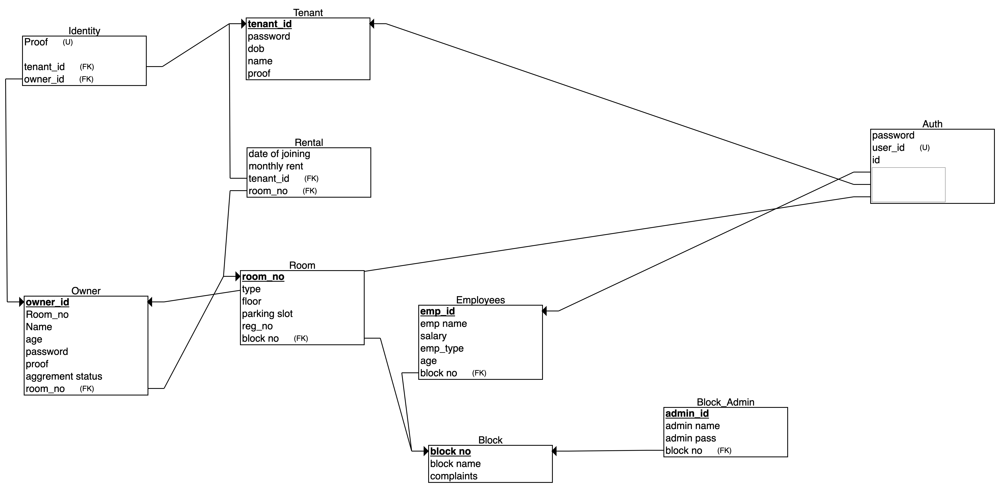

# Apartment Management System

I created this project as a part of the Database Management System Course (CS440).
# Contents
- Project Description
- Basic Structure
  - Functionalities
  - ER Diagram
  - Database Schema
  - Screenshots of the Interface
- Tech Stack
- How to Run
- Contributors

# Project Description

In this project, I created an Apartment management system with a user interface and database support. This project is a part of our curriculum, here I solved the problem of manual entry of data in apartments by creating the user interface and storing data in MySQL database.

# Basic Structure

## Functionalities

- Admin
  - Admin can log in.
  - Admin can view the tenant and owner details.
  - Admin can create an owner.
  - Admin can allow parking slot.
  - Admin can view the complaints.
  - Admin can see total Owners.
  - Admin can see total Tenants.
  - Admin can see total Employee.
    
- Owner
  - The owner can see the Tenant's details of his/her owned room.
  - The owner can create a Tenant.
  - The owner can see the complaints from his/her room.
  - The owner can see the Room Details.
  - The owner can see Total Complaint.
  - The owner can see the Number of Employees.

- Tenant
  - Tenant can see the allocated parking slot.
  - Tenant can pay the maintenance fee.
  - Tenant can raise complaints.
  - Tenant can see his/her Tenant ID.
  - Tenant can see his/her Name.
  - Tenant can see his/her Age.
  - Tenant can see his/her DOB.
  - Tenant can see his/her Room no.

- Employee
  - Employees can see all the complaints.
  - Employees can see the Total number of Complaints

- All the admins, owners, tenant, employees can login and logout.

## ER Diagram

<kbd></kbd>

## Database Schema

<kbd></kbd>

## Screenshots of the Implementation

### Admin dashboard

<kbd></kbd>

### Owner dashboard

<kbd></kbd>

### Tenant dashboard

<kbd></kbd>

### Employee dashboard

<kbd></kbd>

# Tech Stack

- Frontend - HTML5, Tailwind CSS, React JS
- Backend - NodeJS, ExpressJS
- Database - MySql

# How to Run

- First, clone the GitHub repo
- Then, install the dependencies by opening the terminal with the path as that of the cloned GitHub folder and do the following

  - For the Client side, cd client

          npm install

  - For the Server side, cd server

          npm install

- Install MySql workbench if you don't have one, and then import the export.sql file under the database folder in Workbench.

- Then in the server folder create a file "config_sql.js" Add the localhost name, database name, username, and password of your SQL workbench and export it.

- Now to run, type the following

  - For the client,

          npm run start

  - For sever,
    npm run start

- Now, you can use the project.
# Login Code
- user_id	password	id
- a-123	  12345678	101
- a-124	  12345678	102
- a-909 	12345678	103
- e-123	  12345678	701
- e-456	  12345678	702
- e-909	  12345678	703
- o-123	  12345678	501
- o-124	  12345678	502
- o-456	  12345678	503
- o-909	  12345678	504
- t-123	  12345678	601
- t-124	  12345678	602
- t-145	  12345678	603
- t-190	  12345678	604
- t-345	  12345678	605

`Thank you!🧑‍💻`
